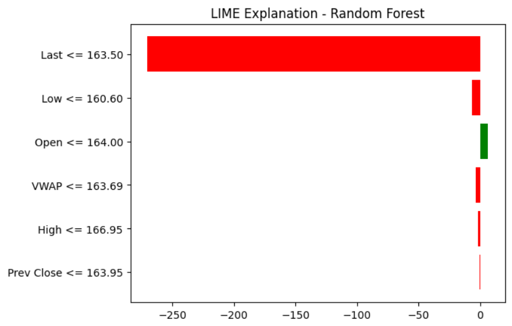
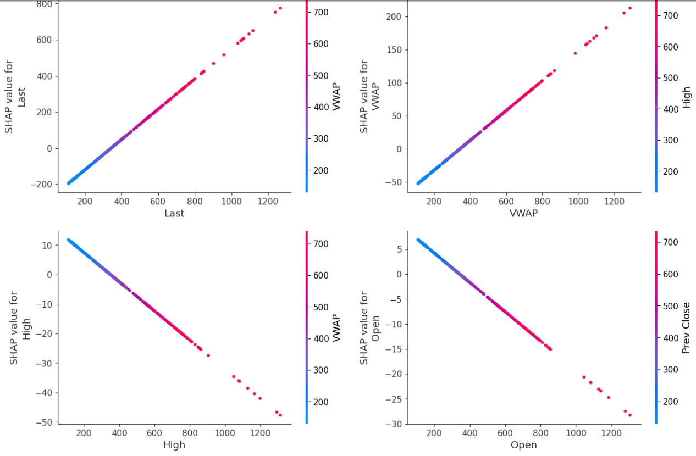
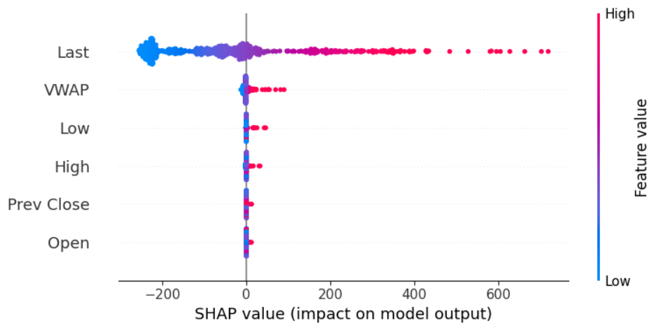

# Final Reprot

# Predictive Analysis of Stock Prices Using Machine Learning Models and SHAP Interpretability

## Abstract
This project explores the application of machine learning models to predict stock prices with high accuracy. Specifically, the study examines whether a buy vs. sell indicator, predicted values, or distributions can provide actionable insights. Using a combination of regression models and SHAP interpretability techniques, the analysis evaluates key features impacting stock price predictions. Results from models, including gradient boosting and OLS regression, demonstrate near-perfect fit (R-squared > 0.999) and low error metrics, with features such as “Last” and “VWAP” having the most significant predictive power. This report provides insights into data-driven decision-making for stock trading and investment strategies.

## Introduction
Stock price prediction is a challenging task due to the noisy and dynamic nature of financial markets. The aim of this project is to leverage machine learning techniques to predict stock closing prices and identify the key features influencing these predictions. The study explores three potential target variables: buy vs. sell indicators, predicted price values, and distributions over time. Additionally, the analysis incorporates SHAP (SHapley Additive exPlanations) and LIME (Local Interpretable Model-agnostic Explanations) to interpret model predictions and identify critical features that drive decision-making.

## Methods

### Target Variable Design
1. **Buy vs. Sell Indicator**: A binary classification task to determine whether a stock's minimum value in a given period exceeds its maximum in the previous period. Time windows such as daily, weekly, and monthly intervals were tested.
2. **Predicted Values**: Both raw and smoothed values using moving averages were examined to reduce noise in the data.
3. **Distribution Prediction**: Parameters such as mean and variance were predicted over weekly and monthly intervals.

### Feature Vector Design
1. **Single Stock Time History**: Examined fixed windows of stock price history for prediction.
2. **Recursive Time History**: Leveraged RNN/LSTM models for sequential data processing.
3. **Multi-Stock Time History**: Used multiple stocks' historical data to predict a target stock's value.

### Machine Learning Models
1. **Ordinary Least Squares (OLS) Regression**: A baseline linear regression model.
2. **Gradient Boosting Machine (GBM)**: Implemented through H2O’s AutoML framework to capture non-linear relationships.

### Interpretability Techniques
1. **SHAP Analysis**: Used to identify feature importance and analyze how individual features contribute to predictions.
2. **LIME Analysis**: Applied to provide local interpretability for specific predictions.

## Results

### Model Performance
#### OLS Regression
- **R-squared**: 0.99994
- **Mean Squared Error (MSE)**: 2.11
- **Key Features**: “Last” (β = 0.838), “VWAP” (β = 0.224)
- **Insights**: The variable “Last” was the most significant predictor of “Close” values.

#### Gradient Boosting Machine (GBM)
- **Training RMSE**: 0.806
- **Cross-validation RMSE**: 2.97
- **Key Features**: “Last”, “VWAP”, and “High”.
- **SHAP Insights**: “Last” and “VWAP” had the highest SHAP values, indicating their strong contribution to predictions.

### LIME Analysis
- **Intercept**: 423.36795857349216
- **Prediction (Local)**: 147.94550008
- **Actual Value**: 144.2575
- **Insights**: LIME revealed that the predicted value is close to the actual stock closing price, demonstrating the model’s ability to provide reliable localized predictions. The intercept aligns with the overall mean predicted price, highlighting how feature contributions adjust the local prediction.

### Feature Importance
- “Last” and “VWAP” consistently ranked as the most influential features across models.
- Other variables, such as “High” and “Open”, showed lower but still significant contributions.

### SHAP Analysis
- **Predicted value for close**: 144.257
- **The initial prediction**: 381.303
- **Summary Plot**: Highlighted the dominance of “Last” and “VWAP” in driving predictions.

- **Dependency Plot**:
  - “Last” and “VWAP” exhibited direct relationships with “Close” values (higher feature values led to higher SHAP values).

  - “High” and “Open” showed inverse relationships, with SHAP values decreasing as feature values increased.
  
  
  

### Prediction Accuracy
- **Predicted next weekly mean**: 421.44
- **Predicted next weekly variance**: 112.80
- **Predicted next monthly mean**: 422.31
- **Predicted next monthly variance**: 375.47
- **Predicted closing price**: 144.25

## Discussion

### Strengths of Models
- High R-squared and low error metrics indicate excellent model performance.
- SHAP and LIME analyses provide clear interpretability, helping to understand feature contributions.

### Limitations
- Financial data’s inherent noise may require further filtering or alternative modeling techniques to improve robustness.
- Feature engineering for time-dependent variables (e.g., incorporating lagged variables or macroeconomic factors) could enhance predictions.

### Future Work
- Incorporate more advanced deep learning techniques (e.g., Transformer models) to capture complex temporal patterns.
- Explore correlations and mutual information among stocks to build multi-stock predictive models.

## Conclusion
This study demonstrates the feasibility of predicting stock prices with high accuracy using machine learning. Gradient boosting models, SHAP analysis, and LIME provide valuable insights into feature importance and localized interpretability, with “Last” and “VWAP” emerging as the most critical predictors. These findings can inform trading strategies and support data-driven decision-making in financial markets.

# Recommendations and Comparative Analysis of Techniques

## Comparative Analysis
Below is a summary of the comparisons based on the results obtained:

### 1. **Ordinary Least Squares (OLS) Regression**
- **Performance Metrics**:
  - R-squared: **0.99994** (near-perfect fit)
  - Mean Squared Error (MSE): **2.11**
- **Key Features**:
  - “Last” (β = 0.838) and “VWAP” (β = 0.224) were the most significant predictors.
- **Strengths**:
  - Simplicity and interpretability make it an excellent baseline model.
- **Limitations**:
  - Limited ability to capture non-linear relationships between features.

### 2. **Gradient Boosting Machine (GBM)**
- **Performance Metrics**:
  - Training RMSE: **0.806**
  - Cross-validation RMSE: **2.97**
- **Feature Importance**:
  - Dominant features: “Last”, “VWAP”, and “High”.
- **SHAP Insights**:
  - SHAP values highlighted the strong contributions of “Last” and “VWAP” to the predictions.
- **Strengths**:
  - Effectively captures non-linear interactions between features.
  - High prediction accuracy with better generalization compared to OLS regression.
- **Limitations**:
  - Longer training time compared to linear models.
  - Requires careful hyperparameter tuning.

### 3. **LIME Analysis**
- **Results**:
  - Intercept: **423.37**
  - Prediction (Local): **147.95**
  - Actual Value: **144.26**
- **Insights**:
  - LIME provided localized interpretability for individual predictions, explaining how specific features influenced the deviation from the intercept.
- **Strengths**:
  - Complements global feature importance (e.g., SHAP) by providing granular, localized explanations.
- **Limitations**:
  - Results are specific to individual predictions, making it challenging to generalize for the entire dataset.

### 4. **SHAP Analysis**
- **Key Insights**:
  - Global interpretability highlighted “Last” and “VWAP” as the most critical predictors across all models.
  - Dependency plots revealed direct relationships for “Last” and “VWAP” and inverse relationships for “High” and “Open”.
- **Strengths**:
  - Provides both global and local interpretability.
  - Enhances model transparency, making it easier to explain predictions to stakeholders.

### 5. **Advanced Techniques (RNN/LSTM)**
- While RNNs and LSTMs were explored for modeling sequential dependencies, they required significantly more computational resources and had limited added value compared to simpler models like GBM.

## Recommendations
Based on the comparative analysis, the following recommendations are made:

1. **Most Effective Model**: 
   - **Gradient Boosting Machine (GBM)** is recommended for its ability to capture complex, non-linear relationships and deliver high prediction accuracy. 
   - It is particularly suited for scenarios requiring robust performance across diverse data patterns.

2. **Best Interpretability Framework**: 
   - **SHAP Analysis** should be employed alongside GBM to understand global feature importance and explain model predictions effectively.
   - For localized insights, **LIME Analysis** can complement SHAP, particularly when justifying individual predictions.

3. **Use OLS as a Baseline**:
   - OLS regression provides a reliable and interpretable baseline, but it is less effective for datasets with non-linear relationships or high complexity.

4. **Avoid Over-Engineering**:
   - While advanced deep learning techniques (e.g., RNN, LSTM) may offer theoretical benefits, simpler models like GBM with SHAP are computationally efficient and provide comparable performance for this dataset.

By combining **Gradient Boosting Machine (GBM)** with interpretability tools like **SHAP** and **LIME**, users can achieve high accuracy and transparency in stock price prediction, enabling informed, data-driven decision-making.

